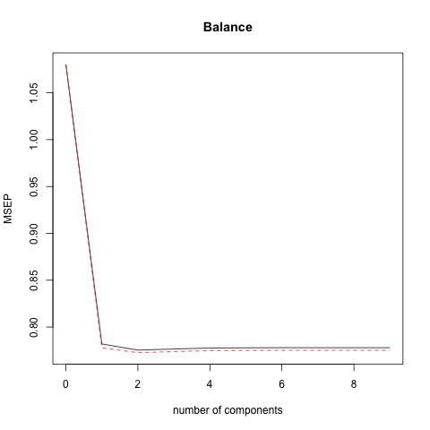

## Abstract

This paper aligns with the analysis from Chapter 6 _Linear Model Selection and Regularization_ from "An Introduction to Statistical Learning" by James _et. all_. This chapter looks at credit data and assesses what type of linear regression model will best fit the data in order to predict the response. To determine the most accurate linear model for this data, we look at shrinkage methods and dimension reduction methods to predict Balance (in thousands) in terms of ten predictors such as Income (in thousands), Age, Education, Gender, Ethnicity, etc. We then analyze the errors associated with each method to determine the optimal regression model to fit the data.

## Introduction

Predictive modeling should be conducted in order to increase the predictability of a model. If we were to test just one model on our dataset, we may get a model that has a low predictive error but there is the possibility that another model would produce an even lower predictive error, giving us better results. We use predictive modeling in this analysis to look at the [Credit](http://www-bcf.usc.edu/~gareth/ISL/Credit.csv) dataset used in Chapter 6 _Linear Model Selection and Regularization_ from "An Introduction to Statistical Learning" by James _et. all_ and assesses what type of linear regression model will best fit the data in order to predict the response, Balance (in thousands), in terms of ten predictors.

The Credit dataset contains both quantitative and qualitative variables. When working with a dataset populated with both quantitative and qualitative variables, we must dummy out categorical variables to allow for the use of qualitative data in a linear model. We then want mean center and standardize our variables, meaning that each variable will have mean zero and standard deviation 1. We do this if our variables are set on a wide range of scales (i.e. Income recorded in the thousands, whereas Gender is represented as a binary 0 or 1) and this technique allows all predictors to be used in the model and none are overshadowed. While one typically fits the model $Y \approx \beta_0 + \beta_1X_1 + \beta_2X_2 + ... + \beta_pX_p + \epsilon$ using least squares, we would like to look at extending this model to apply to non-linear, but still additive relationships. In particular, we will look at shrinkage methods and dimension reduction techniques to fit the data. Shrinkage methods involve fitting a model using all _p_ predictors. However to reduce both bias and variance, the estimated coefficients are shrunken towards zero relative to the least squares estimate. In effect, we are sacrificing unbiasdness to make a greater reduction in the variance component. Given we have too many predictor variables relative to the number of observations, we can use a shrinkage method to determine which predictor variables are significant. Dimension reduction techniques involve reducing the number of predictor variables in estimating a response. This is accomplished by projecting the _p_ predictor into an _M_-dimensional subspace with _M < p_. _M_ different _linear combinations_ of the variables are then computed, then the projections are used as predictors to fit a linear regression model by least squares. The results from these regression methods are then compared by mean standard error to choose the most accurate model to fit the data. This process will be illustrated in the following sections.


```{r setup1, include=FALSE}
knitr::opts_chunk$set(echo = TRUE)
library(stargazer)
load('../data/eda-output.RData')
credit <- read.csv("../data/Credit.csv")
# disable scientific notation
options(scipen=999)
```

## Data

The Credit data set is `r nrow(credit)` x `r ncol(credit)` in dimensions. There are _n_ = `r nrow(credit)` rows (data points) and there are `r ncol(credit)` columns (variables):

- `X`: row index

- `Income`: income (in thousands of dollars)

- `Limit`: credit limit

- `Rating`: credit rating

- `Cards`: number of credit cards

- `Age`: age

- `Education`: years of education

- `Gender`: gender

- `Student`: student status

- `Married`: marital status

- `Ethnicity`: Caucasian, African American or Asian

- `Balance`: average credit card debt

### Descriptive Statistics

First, we look at the quantiative variables, specifically Income, Limit, Rating, Cards, Age, Education and Balance.

```{r results='asis', echo=FALSE}
stargazer(sd_range, title = 'Summary statistics quantitative variables', type='latex', header=FALSE, summary=FALSE)
```

From these summary statistics, we note the wide range for Income as approximately $`r round(sd_range["Income", "Range"],0)`$ (in thousands), as well as the range for Limit and Rating as $`r sd_range["Limit", "Range"]`$ and $`r round(sd_range["Rating", "Range"],0)`$, respectively. Balance, or average credit card debt, also has a large spread, with a range of $`r sd_range["Balance", "Range"]`$. Our standard deviations for these high-range variables are also high, with a maximum standard deviation of over $`r round(max(sd_range[, 1]),2)`$ for $`r row.names(sd_range[which(sd_range[,1]==max(sd_range[, 1])),])`$.

Next, we look at the qualitative variables, incuding Gender, Student, Married and Ethnicity.

```{r, out.width = "200px", echo=FALSE, fig.align="center, fig.show='hold'"}
knitr::include_graphics("../images/barchart-gender.png")
knitr::include_graphics("../images/barchart-student.png")
```

```{r, out.width = "200px", echo=FALSE, fig.align="center, fig.show='hold'"}
knitr::include_graphics("../images/barchart-married.png")
knitr::include_graphics("../images/barchart-ethnicity.png")
```

It is interesting to note the distribution of relative frequencies across these qualitative variables. While the relative frequency between gender is almost equivalent, there are many more non-students in the dataset than there are students. The relative proportion of married individuals as well as Caucasian is higher than unmarried as well as African American and Asian.

### Assocation between Balance and predictors

Because we are interested in studying the association between Balance and the rest of the predictors, we created a visual representation of the correlation between Balance and each variable. We created a scatterplot matrix between Balance and the quantitative variables, and created conditional boxplots for each of the qualitative variables.

```{r, out.width = "200px", echo=FALSE, fig.align="center"}
knitr::include_graphics("../images/scatterplot-matrix.png")
```

It is clear from the scatterplot matrix that the correlation between Limit and Rating almost represents a perfect linear relationship, while the correlation between Limit and Income as well as Rating and Income is also close to linear. Because the relationship between Income, Limit, and Rating is strong, we don't use Limit or Rating in our models because their effect on Balance is captured by Income. Since we are interested in Balance, we note that the correlation between Balance and Limit and Rating appears to be linear. The relationship between Balance and the other predictors seems to take more of a non-linear relationship. We will note the strong correlation between Balance and Limit and Rating and come back to this later when we build our model.

```{r, out.width = "200px", echo=FALSE, fig.align="center, fig.show='hold'"}
knitr::include_graphics("../images/boxplot-gender.png")
knitr::include_graphics("../images/boxplot-student.png")
```

```{r, out.width = "200px", echo=FALSE, fig.align="center, fig.show='hold'"}
knitr::include_graphics("../images/boxplot-married.png")
knitr::include_graphics("../images/boxplot-ethnicity.png")
```

In these conditional boxplots we can see that there is some variation in each boxplot amongst the different options, and in the conditional boxplot of Balance on Student, we note a higher difference in Balance between students and non-students.

### Data formatting and standardization

In order to use all of the qualitative variables in our models we will create, it was necessary to convert factors into dummy variables. This assured that qualitative variables would be represented quantitatively, and could be used as predictors to the response. For example, we converted `Married` to a boolean value of 1 if the individual indicated that they are married and 0 if the indivdiual indicated they are not married.

Another important part of the pre-modeling data process was to mean center and standardize all of the variables. This means that each variable will have mean zero, and standard deviation one. This was to avoid favoring a certain coefficient. 

### Training and testing sets

To test our models, it was important for us to create training data (for the model to learn on) and testing data (to test how accurate our model is in predicting the response). Creating a training set and using it to fit all of our models allows us to directly compare each models' predictability of the test data directly to that of the other models. Since our dataset contains `r nrow(credit)` observations, we randomly sampled 75% of the data (`r nrow(credit)*.75` rows) as our _training set_ and the remaining 25% of the data (`r nrow(credit)*.25` rows) as our _testing  set_.


## Methods

To understand what features are most predictive of Balance, we tested using 5 models: Ordinary Least Squares (OLS), LASSO Regression, Ridge Regression, Principle Component Regression (PCR) and Partial Least Squares Regression (PLSR). OLS is an approach to predicting a quantitative response $Y$ based on a multiple predictor variables $X_1$ through $X_p$, where $Y$ and $X_1$ through $X_p$ are vectors and each value in each $X_{ij}$ ($x_{ij}$) has a corresponding value in $Y$ ($y_i$). The model assumes that the relationship between every $X_i$ and $Y$ is linear and that each $X_j$ isn't correlated with any other $X_j$. OLS can be written as $Y \approx \beta_0 + \beta_1X_1 + \beta_2X_2 + ... + \beta_pX_p + \epsilon$, where $\beta_0$ is the intercept and $\beta_1$ through $\beta_p$ are the slopes of their corresponding predictor variable $X_j$. The beta values are all constants, unknowns, and together are the model coefficients. The interpretation of $\beta_0$ is the expected mean value of $Y$ without a predictor variable and the interpretation of $\beta_1$ through $\beta_p$ is the change in $Y$ for a unit increase in the beta's corresponding $X_j$. Although the betas are unknown, we can estimate them using the OLS model: solving for the intercept and slopes that produce the plane closest to each point ($x_{ij}$,$y_i$) in each $X_j$,$Y$, which is minimizing the residual sum of squares ($RSS$). Once we have an estimate for the betas, we can compute using OLS to determine the strength of the relationship between each $X_j$ and $Y$, if the relationship is statistically significant, and asses how accurately the model predicts the relationship.

LASSO relies upon the OLS model but uses a different procedure in order to estimating the coefficients $\beta_1$ through $\beta_p$. This new procedure sets a number of the betas to exactly zero, making the LASSO in a sense less flexible than OLS. However, the LASSO is more interpretable than OLS because in the final model, $Y$ is only related to a small subset of the $X$'s -- those with nonzero beta coefficients.

Ridge Regression also relies upon the OLS model, but like LASSO, it uses a different procedure in order to estimate the betas. Rather than estimating the betas that minimize $RSS$ like OLS, Ridge imposes a tuning parameter $\lambda$ to the sum of the betas (together called the shrinkage penalty) and adds this shrinkage penalty to RSS before solving for the beta values. The shrinkage penalty is small when the betas are close to zero; thus, it shrinks the estimated betas toward zero. The tuning parameter is calculated separately from the model, controling the impact of both itself and the shrinkage penalty on the beta estimates. If the tuning parameter is zero, the penalty term has no effect and Ridge will produce the same betas as OLS. As the tuning parameter appoaches infinity, the penalty term's impact increases and the Ridge beta estimates approach zero. Unlike LASSO, the beta coefficients produced by Ridge will never be exactly zero, and thus the model is not as easy to interpret.

PCR is a dimension reduction technique for regression that utilizes Principle Component Analysis (PCA). PCA uses an orthogonal transformation to convert a set of observations of potentially correlated variables into a set of uncorrelated variables, called principal components. These principal components are generated by identifying linear combinations, or directions, that best represent the $X$'s. The number of generated components is always less than or equal to the number of original variables. The PCA transformation occurs is defined in a way that causes the first principal component to have the largest possible variance and each succeeding component to have the highest variance possible under the constraint that it is orthogonal to the preceding components. The resulting vectors are an uncorrelated orthogonal basis set. Additionally, PCA is sensitive to the relative scaling of the original variables. As applied to PCR, we assume that the directions in which $X_1$ through $X_p$ show the most variation are the directions that are associated with $Y$ and thus a model using the components rather than the $X$'s will be better because the components account for the variability of the $X$'s while reducing the dimensionality, reducing overfitting.

PLSR is similar to PCR but it generates components in a supervised way. In PCR, the linear combinations identified to generate the components are identified in an unsupervised way, since the response $Y$ isn't used to help determine the linear combinations. Thus, in PCR, there is no guarantee that the components that best explain the predictors will also be the best components to use for predicting the response. PLSR uses $Y$ in order to identify new features that approximate the old features and are related to $Y$ -- attempting to find components that help explain both the response and the predictors.

To solve for $\lambda$ in LASSO and Ridge and to solve for the number of components in PCR and PLSR, we use cross-validation. Cross-validation is a model validation technique used to assess how the results of an analysis will generalize to an independent data set. In this analysis, we use cross-validation to improve prediction to estimate how accurately our various models will perform in practice. To cross-validate a model, we fit its required estimated parameters using k parts of a training dataset and then test the k created models on an unseen test dataset. We then chose the model that minimizes the predictive error. If the model performs well using the test dataset (meaning it has a low predictive error), we are more confident that this model is accurate (since it produces good prediction of data not used to fit the model). For the case of LASSO and Ridge, we chose the cross-validated model having the minimum $\lambda$ value, and for PCR and PLSR, we chose the cross-validated model having the minimum $PRESS$ (Predicted Residual Sum of Squares). Both the minimum $\lambda$ and minimum $PRESS$ are of the model having the least predictive error out of the models in a given cross-validated set of models.


```{r setup2, include=FALSE}
knitr::opts_chunk$set(echo = TRUE)
library(stargazer)
load('../data/osl.RData')
load('../data/ridge-cv.RData')
load('../data/lasso-cv.RData')
load('../data/pcr-cv.RData')
load('../data/plsr-cv.RData')
```

## Analysis

### OSL

Our first method was OSL Regression. Below is the table of coefficients of each predictor when regressed against `Balance`.

```{r results='asis', echo=FALSE}
library(stargazer)
stargazer(osl_summary_fit$coefficients, title = 'Coefficient estimates OSL', type='latex', header=FALSE, summary=FALSE)
```

It is interesting to note those predictors which have a negative coefficient estimate on `Balance`. `Income`, `Education`, `Gender: Female`, and `Married: Yes` all have a negative relationship with `Balance`, indicating that an increase in any one of those categories (for `Gender` and `Married` this would simply be the boolean value of 1) would result in a decrease in `Balance`. 

#### Lasso

Next we ran a LASSO regression: fitting the model using out training data and cross-validating to determine the lambda value that minimizes mean-squared error. From this cross-validation, we found this minimum lambda value to be `r lasso_lambda`.

```{r, out.width = "200px", echo=FALSE, fig.align="center"}
knitr::include_graphics("../images/lasso-cv.png")
```

We then ran this model on our test data to produce the model's MSE (telling us within what range we can predict `Balance`) and finally ran the model on our full dataset to produce the model's coeficients.

#### Ridge Regression

We also ran a Ridge regression using the same methods as the LASSO regression. First we fit the model using out training data and cross-validated to determine the lambda value that minimizes mean-squared error: `r ridge_lambda`.

```{r, out.width = "200px", echo=FALSE, fig.align="center"}
knitr::include_graphics("../images/ridge-cv.png")
```

Then we ran the model with this lambda on our test data to produce the model's MSE. Last, we ran the model on our full dataset to produce the model's coeficients.

#### Principle Component Regression (PCR)

Our method for fitting a PCR model is similar to our methods for fitting our LASSO and Ridge models in that we first fit the model using out training data and cross-validate. However, rather than solving for a lambda value, we now solve for the number of components with the smallest Predictive Residual Error Sum of Squares ($PRESS$). This number of components will explain the most variance in the response and thus will be the best model of our PCR models. Fom our cross-validation, we find the number of components with the minimum $PRESS$ value to be `r pcr_ncomp`.

```{r, out.width = "200px", echo=FALSE, fig.align="center"}
knitr::include_graphics("../images/pcr-cv.png")
```

Again similar to the process of both LASSO and Ridge, we then ran the model with this number of components on our test data to produce the model's MSE and finally ran the model on our full dataset to produce the model's coeficients.

#### PLSR

The final model was fit was PLSR. Like PLSR, we first fit the model using our training data and cross-validated to determine the number of components with the minimum $PRESS$: `r plsr_ncomp`.

```{r, out.width = "200px", echo=FALSE, fig.align="center"}

```

Then ran the model with this number of components on our test data to produce the model's MSE and finally ran the model on our full dataset to produce the model's coeficients.


```{r setup3, include=FALSE}
knitr::opts_chunk$set(echo = FALSE)
library(stargazer)
library(knitr)
load('../data/eda-output.RData')
load('../data/regression-results.RData')
```

## Results

### Regression coefficients for all methods

Because each model we fit uses a different method to fit the betas, the beta coefficients are different for each model. This is evident in the table below.

```{r kable, echo=FALSE}
kable(coefs_df)
```

However, we note that many of the features have a similar magnitude on `Balance` for all of the models. For example, for OLS, Lasso, Ridge, and PLSR, `Income` has the greatest magnitude on `Balance` out of all the features. We also notice that other feature magnitudes tend to be similar across the models, such as that of `Student:Female` and also `Married:Yes`.

### Plotting the official coefficients

To get a better understanding of how to coefficient values differ across models, we plot the coefficient values for each model in the following overlapping line chart.

``` {r, echo = FALSE}
par(mar=c(7, 5, 2, 2))
matplot(coefs_df, type = "l", xaxt = "n", ylab = "Coefficient Estimate", col = c(1:5))
axis(1, at = 1:9, labels = row.names(coefs_df), cex.axis = 0.7, las = 2)
legend("topright", inset=.05, legend=c("OLS", "Lasso", "Ridge", "PCR", "PLSR"), pch=1, col=c(1:5), horiz=FALSE, bty = "n")
title("Official Coefficients")
```

From this line chart, we see that the coefficients of PCR are the most stable and most different than that of the other models. OLD, Ridge, LASSO, and PLSR all estimate similar coefficient values for each feature. Coefficient estimate consistancy across models informs us that the coefficient magnitudes aren't being inflatted or deflatted due to a model's paramters, but rather are being estimated in a less-biased way. When chosing one model in order to predict `Balance`, we look to chose a model having estimated coefficients consistant with other models.

### MSE values for the regression techniques

To determine which model has the most predictive power of `Balance`, we compare the MSE of the various models.

```{r, echo=FALSE}
kable(mse_df)
```

From the above table, we see the minimum MSE is that of Ridge ($`r min(mse_df[, 1])`$). This tells us that our Ridge model predicts `Balance` within plus or minus $`r round(min(mse_df[, 1])*1000,0)`. Considering the standard deviation of `Balance` is $`r sd_range["Balance", "SD"]`$, this means we can predict `Balance` within just over one standard deviation using our Ridge model. Although predicting `Balance` within less than one standard deviation would be more ideal, our Ridge model predicts `Balance` within the smallest range of all of our tested models. Because the Ridge coefficients fall in line with that of 3 other models (LASSO, PLSR, and OLS) and because it has the minimum MSE, we decide that of the models ran, Ridge has the best predictability of `Balance`.


# Conclusion

Of the models assessed in this analysis, we find that the Ridge model has the best predictive power of `Balance` because it has the lowest MSE of all the model and its estimated beta coefficients are consistant with the estimated coefficients of LASSO, OLS and PLSR. We also discover from our analysis that the analysis from Chapter 6 _Linear Model Selection and Regularization_ in "An Introduction to Statistical Learning" can be reproduced -- since we assessed what type of linear regression model will best fit the `Credit` dataset in order to predict `Balance` as assessed in the chapter. Similar to the analysis performed in Chapter 6, we've made this analysis reproducible as well: simply follow the instructions for reproducing our analysis in the `README.md` file in out [github repository](https://github.com/mosmart/stat159-fall2016-project02) for this analysis.