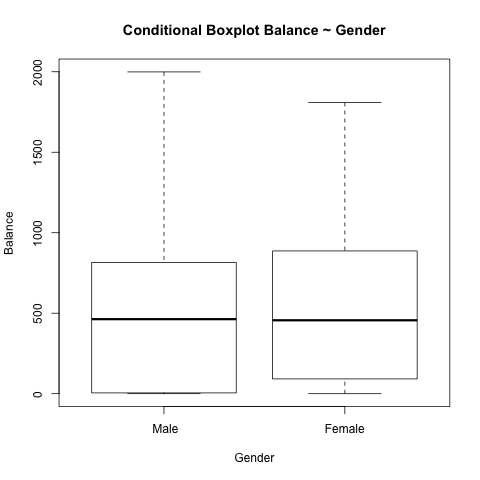
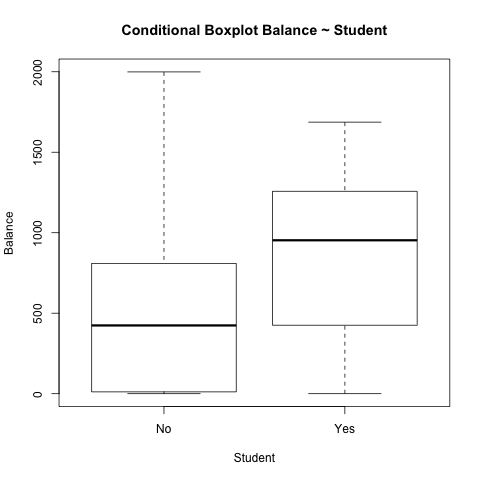
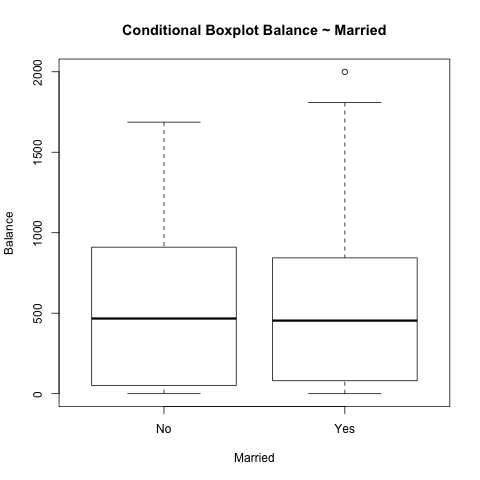
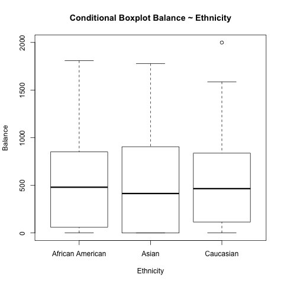

```{r setup, include=FALSE}
knitr::opts_chunk$set(echo = TRUE)
library(stargazer)
load('../../data/eda-output.RData')
```

## Data

The Credit data set is 400 x 12 in dimensions. There are _n_ = 200 rows (data points) and there are 12 columns (variables):

- `X`: row index

- `Income`: income (in thousands of dollars)

- `Limit`: credit limit

- `Rating`: credit rating

- `Cards`: number of credit cards

- `Age`: age

- `Education`: years of education

- `Gender`: gender

- `Student`: student status

- `Married`: marital status

- `Ethnicity`: Caucasian, African American or Asian

- `Balance`: average credit card debt

### Descriptive Statistics

First, we take a look at the quantiative variables, specifically Income, Limit, Rating, Cards, Age, Education and Balance.

```{r results='asis', echo=FALSE}
stargazer(sd_range, title = 'Summary statistics quantitative variables', type='latex', header=FALSE, summary=FALSE)
```

From these summary statistics, we note the wide range for Income as approximately 176 (in thousands), as well as the range for Limit and Rating as 5000 and 340, respectively. Balance, or average credit card debt, also has a large spread, ranging from 0 to almost 2000. Our standard deviations for these high-range variables are also high, with a maximum standard deviation of over 2000 for Limit.

Next, we look at the qualitative variables, incuding Gender, Student, Married and Ethnicity.

```{r, out.width = "200px", echo=FALSE, fig.align="center, fig.show='hold'"}
knitr::include_graphics("../../images/barchart-gender.png")
knitr::include_graphics("../../images/barchart-student.png")
```

```{r, out.width = "200px", echo=FALSE, fig.align="center, fig.show='hold'"}
knitr::include_graphics("../../images/barchart-married.png")
knitr::include_graphics("../../images/barchart-ethnicity.png")
```

It is interesting to note the distribution of relative frequencies across these qualitative variables. While the relative frequency between gender is almost equivalent, the relative frequency of student varies by a factor of almost 0.8. The relative proportion of married individuals as well as Caucasian is higher than unmarried as well as African American and Asian.

### Assocation between Balance and predictors

Because we are interested in studying the association between Balance and the rest of the predictors, we created a visual representation of the correlation between Balance and each variable. We created a scatterplot matrix between Balance and the quantitative variables, and created conditional boxplots for each of the qualitative variables.

```{r, out.width = "200px", echo=FALSE, fig.align="center"}
knitr::include_graphics("../../images/scatterplot-matrix.png")
```

It is clear from the scatterplot matrix that the correlation between Limit and Rating almost represents a perfect linear relationship, while the correlation between Limit and Income as well as Rating and Income is also close to lienar. Since we are interested in Balance, we note that the correlation between Balance and Limit and Rating appears to be linear. The relationship between Balance and the other predictors seems to take more of a non-linear relationship. We will note the strong correlation between Balance and Limit and Rating and come back to this later when we build our model.

```{r, out.width = "200px", echo=FALSE, fig.align="center, fig.show='hold'"}


```

```{r, out.width = "200px", echo=FALSE, fig.align="center, fig.show='hold'"}


```

In these conditional boxplots we can see that there is some variation in each boxplot amongst the different options, and in the conditional boxplot of Balance on Student, we note a higher difference in Balance between students and non-students.
