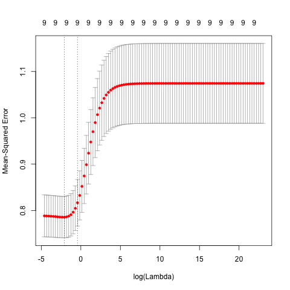

```{r setup, include=FALSE}
knitr::opts_chunk$set(echo = FALSE)
knitr::opts_chunk$set(message = FALSE)
knitr::opts_chunk$set(warning = FALSE)
```

```{r, echo=FALSE}
library(stargazer)
library(knitr)
load('../data/eda-output.RData')
load('../data/osl.RData')
load('../data/ridge-cv.RData')
load('../data/lasso-cv.RData')
load('../data/pcr-cv.RData')
load('../data/plsr-cv.RData')
load('../data/regression-results.RData')
```

## Overview

- This presentation gives an overview of how different regression models can be applied to a dataset to predict an attribute
- We will be using the Credit dataset from "An Introduction to Statistical Learning" by James et all.

## Data

The Credit data set is 400 x 12 in dimensions. There are _n_ = 200 rows (data points) and there are 12 columns (variables):

- `X`: row index
- `Income`: income (in thousands of dollars)
- `Limit`: credit limit
- `Rating`: credit rating
- `Cards`: number of credit cards
- `Age`: age
- `Education`: years of education
- `Gender`: gender
- `Student`: student status
- `Married`: marital status
- `Ethnicity`: Caucasian, African American or Asian
- `Balance`: average credit card debt

## Quantitative Data

First, some summary statistics about our data. Fix this

```{r results='asis', echo=FALSE}
stargazer(sd_range, title = 'Summary statistics quantitative variables', type='latex', header=FALSE, summary=FALSE)
```

## Qualitative Data

Next, we look at the qualitative variables and their relative frequencies.

```{r, out.width = "400px", echo=FALSE, fig.align="center, fig.show='hold'"}

knitr::include_graphics("../images/barchart-student.png")
```

```{r, out.width = "400px", echo=FALSE, fig.align="center, fig.show='hold'"}
knitr::include_graphics("../images/barchart-married.png")

```

## Assocation between Balance and predictors

Because we are interested in studying the association between Balance and the rest of the predictors, we created a visual representation of the correlation between Balance and each variable. We created a scatterplot matrix between Balance and the quantitative variables, and created conditional boxplots for each of the qualitative variables.

```{r, out.width = "500px", echo=FALSE, fig.align="center"}
knitr::include_graphics("../images/scatterplot-matrix.png")
```

## Methods

-Ordinary Least Squares

_Shrinkage Methods_

-Ridge regression

-Lasso regression

_Dimension Reduction Methods_

-Principal Components regression

-Partial Least Squares regression

## OSL

Our first method was OSL Regression. Below is the table of coefficients of each predictor when regressed against `Balance`

```{r results='asis', echo=FALSE}
library(stargazer)
stargazer(osl_summary_fit$coefficients, title = 'Coefficient estimates OSL', type='latex', header=FALSE, summary=FALSE)
```

## Lasso

Add in a description of what Lasso is

```{r, out.width = "500px", echo=FALSE, fig.align="center"}
knitr::include_graphics("../images/lasso-cv.png")
```

The lambda value that minimizes mean-squared error lies at `r lasso_lambda`

## Ridge Regression

Add in a description of what Ridge is

```{r, out.width = "500px", echo=FALSE, fig.align="center"}

```

The lambda value that minimizes mean-squared error lies at `r ridge_lambda`

## Principle Component Analysis (PCA)

Add in a description of what PCA is

```{r, out.width = "500px", echo=FALSE, fig.align="center"}

```

The number of components that minimizes the MSEP is `r pcr_PRESS`

## PLSR

Add in a description of what PLSR is

```{r, out.width = "500px", echo=FALSE, fig.align="center"}
knitr::include_graphics("../images/plsr-cv.png")
```

The number of components that minimizes the MSEP is `r plsr_PRESS`

## Regression coefficients for all methods

```{r kable, echo=FALSE}
kable(coefs_df)
```

## MSE values for the regression techniques (4)

```{r, echo=FALSE}
kable(mse_df)
```

## Plotting the official coefficients

## Conclusion